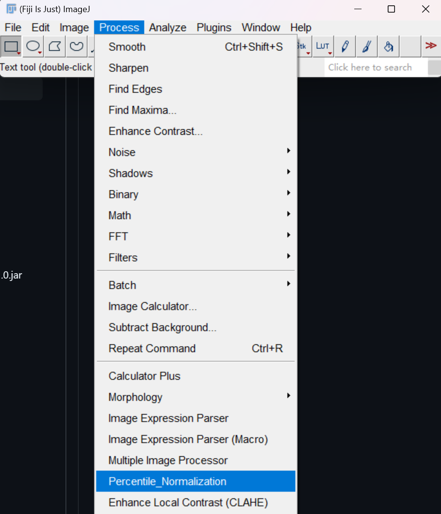
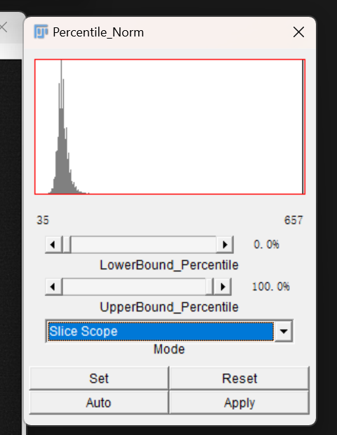

# Percentile_normalization Plugin for imagej

## Introduction

*This plugin is developed for SN2N, a self-inspired learning to denoise method for live-cell super-resolution microscopy.*

- **Preprint:** [Liying Qu et al. Self-inspired learning to denoise for live-cell super-resolution microscopy, bioRxiv (2024).](https://doi.org/10.1101/2024.01.23.576521)

- **Code avaliable:** https://github.com/WeisongZhao/percentile_normalization.imagej
- For the ultralow SNR data with ultrahigh baseline signal and a number of hot pixels, we adapted the routinely used percentile normalization before the data generation step to remove the smooth background or hot pixels. 

*This ImageJ plugin offers real-time execution of Image Percentile Normalization. Users can directly remove the ultra-strong baseline signal before training using this ready-to-use plugin.*  

## How to use

### 1. Add the [Percentile_Norm-0.4.2-SNAPSHOT.jar](target/Percentile_Norm-0.4.2-SNAPSHOT.jar)to your imageJ plugin folder as usual and it will show up in `process->Percentile_Normalization`:

 

<!--  -->
 

### 2. The mainboard and brief introduction to some confusing concepts in it
 

<!--  -->
 

* ### the two number(35,657 in this snapshot) under the histogram:
The left one represent the smallest pixel value in the scope(a slice or stack depending on the *Mode* setting).Accordingly the right one stands for the biggest value in the scope.
* ### Mode:     
this configuration is to specify the scope where we get the x% rank. So the stack scope and slice scope is pretty easy to understand now.
+ ### Set: 
The same function as the sliders above.Just another way the get the input argument lower_percentile and the upper_percentile.
* ### Reset
Undo the changes that happens after the last apply.
* ### Auto
Just click this buttom, the appropriate manipulation may happens on your image. 
* ### Apply
Only do the apply can we save it in the disk later.
 
## 3.Here comes a presentation.

