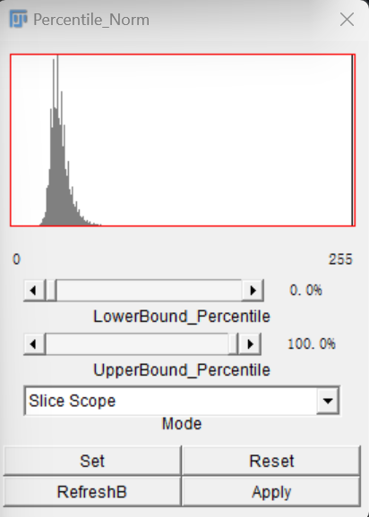

# Percentile_normalization Plugin for imagej

## Introduction

*This Imagej plugin provides a real-time visualization of the Image Percentile Normalization result with Boundary parameters that can be adjusted easily.*

## How to use

### 1. Add the [Adaptive_Median_Filter-0.1.0.jar]()to your imageJ plugin folder as usual and it will show up in `process->Percentile_Normalization`:

### 2. The mainboard and brief introduction to some confusing concepts in it

* ###  the two number(0,255 in this snapshot) under the histogram:
The left one represent the smallest pixel value in the scope(a slice or stack depending on the *Mode* setting).Accordingly the right one stands for the biggest value in the scope.
* ### Mode:     
this configuration is to specify the scope where we get the x% rank. So the stack scope and slice scope is pretty easy to understand now.
+ ### Set: 
The same function as the sliders above.Just another way the get the input argument lower_percentile and the upper_percentile.
* ### Reset
Undo the changes that happens after the last apply.
* ### Refresh
When the UI get stuck or behaves wired,click it may fix the problem.
* ### Apply
Only do the apply can we save it in the disk later.
## Here comes a presentation.
